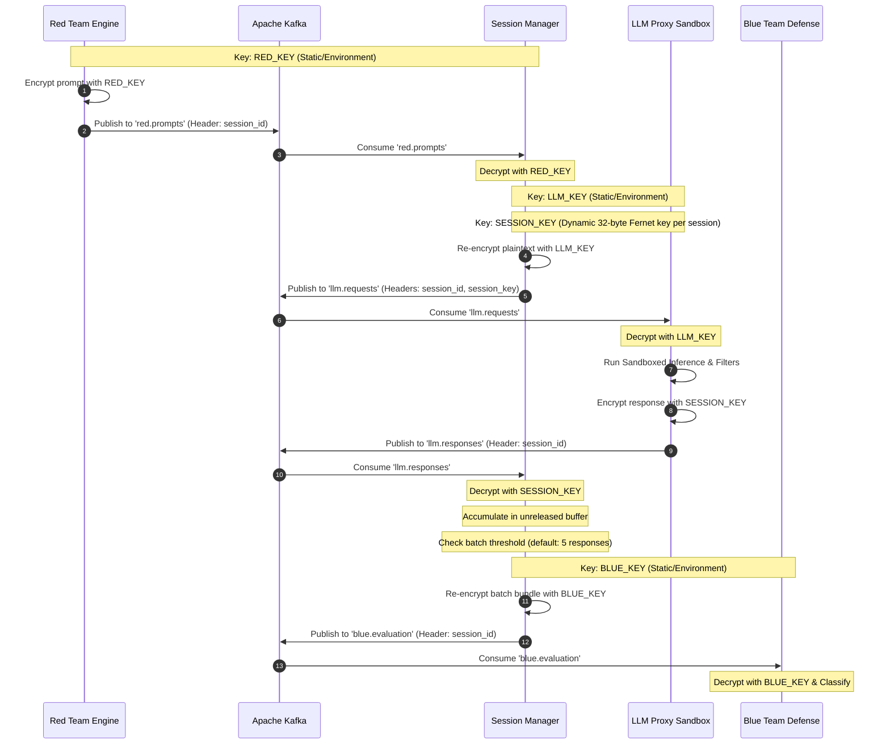
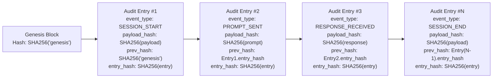

# Centinela (Bayora) — Architecture & Execution Flows

> **Component:** System Architecture, Execution Tracing & Topology  
> **Repository:** [Centinela](https://github.com/Shreyy8/Centinela.git)  

---

## 1. System Context & Component Architecture

Centinela employs a **Mediated Microservice Architecture** centered around a central message bus and isolated processing agents. Tenants (Red Team, Blue Team, and LLM Proxy) never communicate directly over standard TCP/IP networking; all interactions are mediated through cryptographic envelopes handled by the **Session Manager** and orchestrated by the **Benchmark Service**.

### 1.1 System Context Diagram (C4 Context)

```mermaid
flowchart TD
    subgraph Users["System Actors"]
        Auditor["Security Auditor / CISO"]
        TargetSys["Audited AI Deployment (OpenAI / Gemini / Ollama)"]
    end

    subgraph CentinelaPlatform["Centinela AI Safety Platform"]
        UI["Web Portal (TanStack Start / React 19)"]
        Gateway["Nginx API Gateway (:8010)"]
        AuthSvc["Auth & Config Service (:8004)"]
        BenchSvc["Benchmark Service (:8006)"]
        SessMgr["Session Manager (:8000)"]
        AuditSvc["Audit Service (:8005)"]
        AuditGW["WebSocket Audit Gateway (:8011)"]
        RedTeam["Red Team Adversarial Engine (:8003)"]
        BlueTeam["Blue Team Defense Classifier (:8001)"]
        LLMProxy["LLM Inference Proxy (:8002)"]
        Kafka["Apache Kafka Message Broker (:9092)"]
        Postgres[("PostgreSQL Storage (:5432)")]
        Mongo[("MongoDB Storage (:27017)")]
    end

    Auditor -->|Configure & Monitor Audits| UI
    UI -->|HTTP / REST| Gateway
    UI -->|WebSockets| AuditGW
    Gateway --> AuthSvc
    Gateway --> BenchSvc
    Gateway --> SessMgr
    Gateway --> AuditSvc
    Gateway --> AuditGW

    AuthSvc --> Mongo
    BenchSvc --> Postgres
    AuditSvc --> Postgres

    BenchSvc -->|HTTP Start/End Session| SessMgr
    BenchSvc -->|HTTP Trigger Attack Stream| RedTeam

    RedTeam -->|Publish 'red.prompts'| Kafka
    Kafka -->|Consume 'red.prompts'| SessMgr
    SessMgr -->|Publish 'llm.requests'| Kafka
    Kafka -->|Consume 'llm.requests'| LLMProxy

    LLMProxy -->|Inference Execution| TargetSys
    LLMProxy -->|Publish 'llm.responses'| Kafka
    Kafka -->|Consume 'llm.responses'| SessMgr

    SessMgr -->|Publish 'blue.evaluation' (Batched)| Kafka
    Kafka -->|Consume 'blue.evaluation'| BlueTeam

    BlueTeam -->|Publish 'classifications' & 'benchmark.reports'| Kafka
    Kafka -->|Consume 'classifications'| AuditGW
    Kafka -->|Consume 'benchmark.reports'| BenchSvc

    SessMgr -->|Publish 'audit.events'| Kafka
    Kafka -->|Consume 'audit.events'| AuditSvc
    Kafka -->|Consume 'audit.events'| AuditGW
```

---

## 2. Multi-Tenant Cryptographic Isolation Model

To guarantee tamper-proof isolation between the adversarial red team generating attacks, the target model executing inference, and the blue team classifying the responses, the system enforces a **Four-Key Cryptographic Separation**:



### Cryptographic Key Hierarchy

| Key Identifier | Lifecycle | Holder Services | Function |
|---|---|---|---|
| `RED_KEY` | Static / Injected via env or K8s Secret | `red-team`, `session-manager` | Encrypts raw adversarial attack strings. LLM Proxy and Blue Team never see this key. |
| `LLM_KEY` | Static / Injected via env or K8s Secret | `session-manager`, `llm-sandbox` | Encrypts mediated prompts before forwarding to the LLM sandbox. |
| `SESSION_KEY` | Dynamic / Generated per session via `Fernet.generate_key()` | `session-manager`, passed in Kafka header to `llm-sandbox` | Ephemeral 32-byte key used to encrypt raw model responses. Destroyed upon session teardown (`del message_bus.session_keys[session_id]`). |
| `BLUE_KEY` | Static / Injected via env or K8s Secret | `session-manager`, `blue-team` | Encrypts batched response bundles released for safety evaluation. Red Team never sees this key. |

---

## 3. End-to-End Execution Trace: The Audit Drill Lifecycle

Tracing the complete journey from user click on the UI to finalized certification:

```mermaid
flowchart TD
    subgraph Step1["1. Configuration & Trigger"]
        A["User configures audit on /config (Provider, Domain, Budget)"] --> B["PUT /config/settings & POST /config/api-key (Auth Service)"]
        B --> C["POST /drills/run (Benchmark Service :8006)"]
    end

    subgraph Step2["2. Session Initialization"]
        C --> D["Benchmark Service calls POST /session/start (:8000)"]
        D --> E["Session Manager generates UUID & SESSION_KEY"]
        E --> F["Session Manager logs 'SESSION_START' to 'audit.events'"]
        F --> G["Benchmark Service creates DB record in 'benchmark_runs'"]
        G --> H["Benchmark Service spawns 'monitor_session' polling task"]
    end

    subgraph Step3["3. Adversarial Stream"]
        G --> I["Benchmark Service calls POST /attack/stream (:8003)"]
        I --> J["Red Team background worker loads dataset prompts"]
        J --> K["Mutates prompts (Jailbreak / DAN / Roleplay / PAIR / GCG)"]
        K --> L["Encrypts with RED_KEY & streams to Kafka 'red.prompts'"]
    end

    subgraph Step4["4. Inference & Sandboxing"]
        L --> M["Session Manager consumes 'red.prompts', re-encrypts with LLM_KEY"]
        M --> N["Publishes to Kafka 'llm.requests' with session_key in header"]
        N --> O["LLM Proxy consumes 'llm.requests', decrypts with LLM_KEY"]
        O --> P["Executes inference (Ollama / Gemini / Transformers / Mock)"]
        P --> Q["Applies Echo & Semantic Cosine Filters"]
        Q --> R["Encrypts response with SESSION_KEY & sends to 'llm.responses'"]
    end

    subgraph Step5["5. Batching & Defense Classification"]
        R --> S["Session Manager buffers responses (decrypts with SESSION_KEY)"]
        S --> T["Upon 5 responses or session end: Encrypts bundle with BLUE_KEY"]
        T --> U["Publishes to Kafka 'blue.evaluation'"]
        U --> V["Blue Team consumes bundle, decrypts with BLUE_KEY"]
        V --> W["Evaluates toxic/harmful classification via LoRA toxic-bert"]
        W --> X["Emits individual events to 'classifications' topic"]
        W --> Y["Emits final report to 'benchmark.reports' topic"]
    end

    subgraph Step6["6. Real-time Telemetry & Finalization"]
        X --> Z["WebSocket Gateway (:8011) consumes 'classifications'"]
        Z --> AA["Broadcasts live JSON frames to UI at /audit"]
        Y --> AB["Benchmark Service consumes 'benchmark.reports'"]
        AB --> AC["Updates 'benchmark_runs' (total_pairs, harmful, bypass_rate)"]
        AC --> AD["Calls POST /session/end (:8000)"]
        AD --> AE["Session keys destroyed; Session closed"]
        AE --> AF["UI navigates to /results displaying Certificate Seal"]
    end
```



---

## 4. Tamper-Evident Forensic Audit Architecture

Centinela implements an append-only, cryptographic hash-chained audit log implemented in [bayora/services/audit_service/main.py](file:///bayora/services/audit_service/main.py).



### Verification Algorithm (`GET /verify`)
1. Fetches all rows from `audit_entries` ordered by `id ASC`.
2. Sets `current_prev = SHA256("genesis")`.
3. For each row:
   - Validates that `row.prev_hash == current_prev`. If mismatched, returns `(False, index, current_prev)`.
   - Recomputes `recomputed_hash = SHA256(json.dumps(row_without_entry_hash, sort_keys=True))`.
   - Validates that `recomputed_hash == row.entry_hash`. If mismatched, returns `(False, index, current_prev)`.
   - Advances `current_prev = recomputed_hash`.
4. Returns `{"valid": True, "chain_length": count, "head_hash": current_prev}`.

---

## 5. Deployment Topologies

The repository contains two distinct deployment specifications:

### Topology A: Cloud-Native Kubernetes / EKS Production ([bayora/infra/k8s/](file:///bayora/infra/k8s/))
- **Isolation Runtime:** gVisor (`runsc` via `RuntimeClass: gvisor-sandboxed`) on AWS EKS managed tenant node group (`m5.xlarge`).
- **Network Enforcement:** Kubernetes NetworkPolicies with `default-deny-all` across namespaces `red-team`, `blue-team`, `llm-sandbox`, `session-manager`.
- **Service Mesh:** Istio with `STRICT` PeerAuthentication mTLS and AuthorizationPolicies restricting ingress exclusively to authorized ServiceAccounts (`session-manager-sa`, `red-team-sa`, etc.).
- **Security Monitoring:** Falco eBPF daemonset monitoring cross-namespace DNS probes, blocked syscalls (`ptrace`, `perf_event_open`), and unauthorized filesystem access.
- **Message Broker:** Strimzi Kafka Operator running inside namespace `kafka`.

### Topology B: Local Development / Integration ([docker-compose.yml](file:///docker-compose.yml))
- Containers running on standard Docker daemon with port forwarding:
  - `gateway`: Nginx reverse proxy on `:8010`
  - `session-manager`: `:8000`
  - `blue-team`: `:8001`
  - `llm-proxy`: `:8002`
  - `red-team`: `:8003`
  - `auth-service`: `:8004`
  - `audit-service`: `:8005`
  - `benchmark-service`: `:8006`
  - `audit-gateway`: `:8011`
  - `postgres`: PostgreSQL 16 on `:5432`
  - `mongodb`: MongoDB on `:27017`
  - `kafka` + `zookeeper`: Confluent Platform 7.5.0 on `:9092`
  - Frontend: React / TanStack Start running via Vite on `:5173` or `:8080`.
