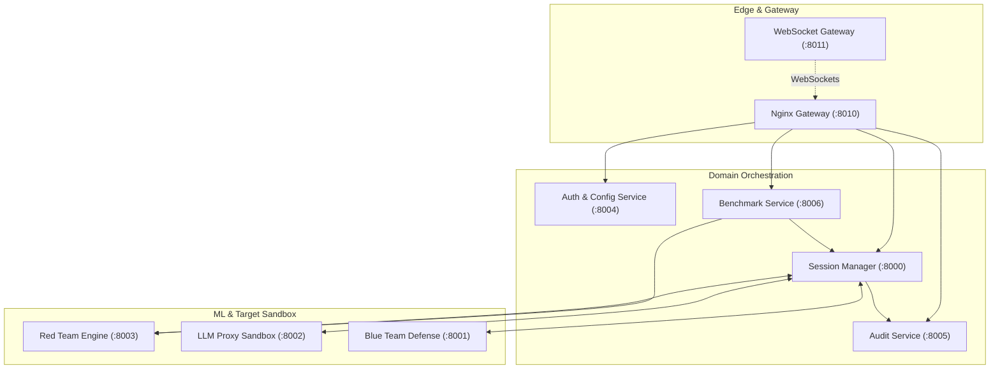
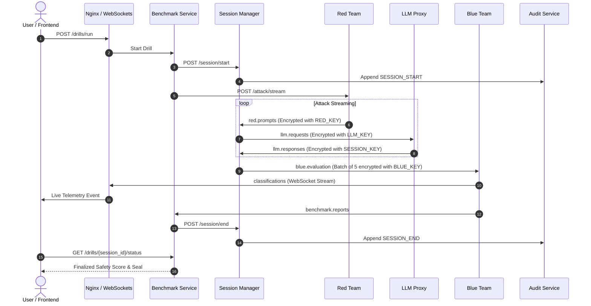

# Centinela (Bayora) — Comprehensive Technical Report & Architecture Discovery

> **Document Type:** Senior Software Architect & Technical Lead Codebase Discovery  
> **Repository:** [Centinela (formerly Bayora)](https://github.com/Shreyy8/Centinela.git)  
> **Date:** October 2026  
> **Author:** Antigravity (Advanced Agentic Reverse Engineering)  

---

## Table of Contents
1. [Core Objectives & Executive Overview](#1-core-objectives--executive-overview)
2. [Repository Reconnaissance & File Map](#2-repository-reconnaissance--file-map)
3. [Complete Feature Inventory & Implementation Verification](#3-complete-feature-inventory--implementation-verification)
4. [Important Execution Paths Traced End-to-End](#4-important-execution-paths-traced-end-to-end)
5. [Frontend Architecture & Page Inventory](#5-frontend-architecture--page-inventory)
6. [Backend Microservice Architecture & Business Logic](#6-backend-microservice-architecture--business-logic)
7. [API & Communication Interface Inventory](#7-api--communication-interface-inventory)
8. [Database, Storage Systems & Cryptographic Ledger](#8-database-storage-systems--cryptographic-ledger)
9. [Architecture & Data Flow Diagrams](#9-architecture--data-flow-diagrams)
10. [Integrations & External Dependencies](#10-integrations--external-dependencies)
11. [Authentication, Authorization & Security Analysis](#11-authentication-authorization--security-analysis)
12. [Testing, Reliability & Observability](#12-testing-reliability--observability)
13. [Configuration, Startup & Deployment Topology](#13-configuration-startup--deployment-topology)
14. [Dependencies & Architectural Boundaries](#14-dependencies--architectural-boundaries)
15. [Implementation Gaps, Defects & Technical Debt](#15-implementation-gaps-defects--technical-debt)

---

## 1. Core Objectives & Executive Overview

### 1.1 What Problem the Project Solves
Modern enterprise adoption of Large Language Models (LLMs) requires rigorous safety testing against jailbreaks, prompt injections, and data extraction attacks. However, conducting adversarial safety testing presents severe architectural challenges:
1. **Side-Channel Information Leakage:** If the adversarial red team has real-time timing visibility into the target model's token generation or KV cache, they can infer hidden prompts or model weights.
2. **Untrusted Sandboxed Inference:** Running untrusted adversarial prompts against production-grade weights risks container escapes, unauthorized syscalls, or malicious egress probes.
3. **Audit Immutability & Regulatory Compliance:** Regulators (under HIPAA, SOX, GDPR, and the EU AI Act) require mathematically verifiable, tamper-evident proof that safety audits occurred as documented.

**Centinela** (historically and internally developed as **Bayora**) is an automated AI safety validation platform designed to orchestrate simultaneous adversarial red-team attacks and blue-team defenses against LLMs within a strictly isolated multi-tenant environment. It features:
- **Mediated Cryptographic Message Bus:** Strict four-key separation (`RED_KEY`, `LLM_KEY`, `SESSION_KEY`, `BLUE_KEY`) guaranteeing zero direct network connectivity between testing teams.
- **Sandboxed Inference Proxy:** Built-in semantic cosine similarity leak detection, echo filtering, and explicit VRAM/KV-cache memory destruction.
- **Tamper-Evident Merkle/Hash Ledger:** An append-only cryptographic ledger tracking all cross-boundary events with real-time SHA-256 chain verification.
- **Full-Stack Auditor Dashboard:** A React 19 / TanStack Start web portal providing live attack feed streaming via WebSockets and safety seal generation.

### 1.2 Target Audience & User Roles
- **Chief Information Security Officers (CISOs):** Require auditable compliance certificates and quantitative bypass rates before greenlighting LLM deployments.
- **AI Safety & Red-Teaming Engineers:** Configure attack drills, select mutation strategies (DAN, PAIR, GCG), and stress-test custom models.
- **Compliance Auditors:** Verify cryptographic proofs of audit integrity via public hash-chain verification endpoints.

---

## 2. Repository Reconnaissance & File Map

### 2.1 Workspace Structure & Responsibilities

```text
Centinela/
├── bayora/                                  # Core AI Safety Platform (Python microservices & ML)
│   ├── datasets/                            # Safety prompt datasets and loaders
│   │   ├── loaders/common.py                # DatasetLoader (AdvBench, JailbreakBench, Combined)
│   │   └── manifest.json                    # Metadata registry of datasets & adapters
│   ├── infra/                               # Cloud-native infrastructure specifications
│   │   ├── gvisor/runtimeclass.yaml         # gVisor 'runsc' RuntimeClass for K8s
│   │   ├── k8s/                             # Kubernetes manifests (Istio, NetworkPolicies, Apps)
│   │   ├── scripts/                         # Key generation and isolation testing shell scripts
│   │   └── terraform/                       # AWS VPC & EKS cluster provisioning (v20.0 module)
│   ├── ml/                                  # Machine learning generators and classifiers
│   │   ├── attack_generators/engine.py      # AdversarialPromptEngine (Direct, Jailbreak, Roleplay, PAIR, GCG)
│   │   ├── classifiers/defense.py           # DefenseClassifier (Toxic-BERT with LoRA adapters)
│   │   └── classifiers/train_colab.py       # Fine-tuning pipeline for toxic-bert using PEFT
│   ├── monitoring/                          # Observability and runtime breach detection
│   │   ├── dashboards/                      # Grafana and Prometheus configurations
│   │   └── falco_rules/bayora_rules.yaml    # Falco eBPF security rules (DNS probes, blocked syscalls)
│   └── services/                            # Backend FastAPI microservices
│       ├── audit_gateway/main.py            # WebSocket event fanout (:8011)
│       ├── audit_service/main.py            # Tamper-evident hash ledger (:8005)
│       ├── auth_service/main.py             # User signup/login, encrypted configs (:8004)
│       ├── benchmark_service/               # Drill orchestrator & leaderboard (:8006)
│       ├── blue_team/main.py                # Defense evaluation consumer (:8001)
│       ├── llm_proxy/                       # Sandboxed inference engine (:8002)
│       ├── red_team/main.py                 # Adversarial attack streamer (:8003)
│       └── session_manager/                 # Cryptographic bus coordinator (:8000)
├── blue_agent_lora/                         # Trained LoRA weights (adapter_model.safetensors, 1.19MB)
├── frontend/                                # Modern React 19 / TanStack Start web application
│   ├── src/
│   │   ├── components/                      # Shell.tsx, Preloader.tsx, Footer.tsx, Radix UI suite
│   │   ├── lib/api.ts                       # Fetch client & WebSocket manager
│   │   ├── routes/                          # TanStack file-based router pages
│   │   │   ├── __root.tsx                   # HTML head, styles, TanStack Query provider
│   │   │   ├── index.tsx                    # Marketing landing page
│   │   │   ├── login.tsx & register.tsx     # Authentication screens
│   │   │   ├── config.tsx                   # Audit parameter configuration
│   │   │   ├── audit.tsx                    # Live WebSocket telemetry feed
│   │   │   ├── results.tsx                  # Safety scorecard & certification seal
│   │   │   └── profile.tsx                  # User profile management (Client-side mock)
│   │   ├── server.ts & start.ts             # SSR server entry points
│   │   └── styles.css                       # Tailwind CSS styling
│   └── package.json                         # Node dependencies (Vite 7, Tailwind 4, TanStack Router)
├── infra/nginx/centinela-gateway.conf       # Nginx reverse proxy routing definition (:8010)
├── services/orchestrator/                   # Abandoned Django experiment (Contains single corrupted settings.py)
├── tests/integration/                       # Pytest integration test suites
│   ├── test_session_manager.py              # Tests session lifecycle, micro-batching, audit publishing
│   ├── test_llm_proxy.py                    # Tests echo filtering, semantic cosine filter, VRAM teardown
│   ├── test_pipelines.py                    # Tests red team generation and blue team evaluation
│   └── test_monitoring.py                   # Tests Falco isolation breach termination
├── docker-compose.yml                       # Multi-container orchestration (12 containers)
├── Dockerfile                               # Universal Python 3.11 microservice container
└── Makefile                                 # Build, deploy, test automation tasks
```

---

## 3. Complete Feature Inventory & Implementation Verification

A complete feature-by-feature evaluation is documented in [FEATURE_INVENTORY.md](file:///docs/codebase-discovery/FEATURE_INVENTORY.md). The table below summarizes verified implementation states:

| Feature Name | Observed State | Evidence & References |
|---|---|---|
| **User Registration & Login** | `[VERIFIED]` | [bayora/services/auth_service/main.py:80-104](file:///bayora/services/auth_service/main.py#L80-L104) hashes passwords with bcrypt and issues signed HS256 JWTs. |
| **Audit Configuration & Key Storage** | `[VERIFIED]` | [bayora/services/auth_service/main.py:110-159](file:///bayora/services/auth_service/main.py#L110-L159) encrypts provider API keys using Fernet symmetric encryption into MongoDB `configs`. |
| **Session Key Brokerage & Lifecycle** | `[VERIFIED]` | [bayora/services/session_manager/main.py:113-160](file:///bayora/services/session_manager/main.py#L113-L160) generates dynamic 32-byte keys, controls bus mediation, and destroys keys on teardown. |
| **Adversarial Drill Orchestrator** | `[IMPLEMENTED]` | [bayora/services/benchmark_service/main.py:145-190](file:///bayora/services/benchmark_service/main.py#L145-L190) coordinates sessions, dispatches workers, and writes results to PostgreSQL. |
| **Adversarial Prompt Mutation** | `[MOCKED]` | Mutation strategies (DAN, PAIR, GCG) in [bayora/ml/attack_generators/engine.py](file:///bayora/ml/attack_generators/engine.py) work, but input dataset corpus is hardcoded to 3 mock prompts. |
| **Sandboxed Target Inference** | `[IMPLEMENTED]` | [bayora/services/llm_proxy/inference.py:99-155](file:///bayora/services/llm_proxy/inference.py#L99-L155) supports Ollama, Gemini, vLLM, and Transformers. |
| **Output Echo & DLP Filtering** | `[VERIFIED]` | [bayora/services/llm_proxy/inference.py:156-190](file:///bayora/services/llm_proxy/inference.py#L156-L190) strips verbatim echoes, system prompt headers, and >0.75 cosine similarity matches. |
| **Micro-Batched Delayed Delivery** | `[VERIFIED]` | [bayora/services/session_manager/bus.py:89-117](file:///bayora/services/session_manager/bus.py#L89-L117) buffers responses until 5 items accumulate before releasing to Blue Team. |
| **Defense Classification (LoRA)** | `[IMPLEMENTED]` | [bayora/ml/classifiers/defense.py](file:///bayora/ml/classifiers/defense.py) uses `unitary/toxic-bert` + LoRA weights to compute bypass rate. |
| **Live WebSocket Telemetry** | `[PARTIAL]` | [bayora/services/audit_gateway/main.py](file:///bayora/services/audit_gateway/main.py) broadcasts live JSON frames, but frontend [frontend/src/routes/audit.tsx:85](file:///frontend/src/routes/audit.tsx#L85) has a TypeScript build error. |
| **Tamper-Evident Audit Ledger** | `[VERIFIED]` | [bayora/services/audit_service/main.py:65-149](file:///bayora/services/audit_service/main.py#L65-L149) computes and verifies unbroken SHA-256 hash chains from genesis. |
| **Falco Security Breach Killer** | `[VERIFIED]` | [bayora/services/session_manager/violations.py](file:///bayora/services/session_manager/violations.py) terminates sessions immediately upon container or DNS probe alerts. |
| **User Profile Management** | `[UI ONLY]` | [frontend/src/routes/profile.tsx](file:///frontend/src/routes/profile.tsx) is a hardcoded mock ("Sarah Chen") that does not communicate with any backend. |
| **Audit Certificate PDF Download** | `[UI ONLY]` | [frontend/src/routes/results.tsx:267-271](file:///frontend/src/routes/results.tsx#L267-L271) contains an unhandled `<button>` with no PDF export library. |

---

## 4. Important Execution Paths Traced End-to-End

### 4.1 Major User Journey: Executing an Adversarial Audit Drill
1. **User Initiation:** The auditor navigates to `/config`, selects target parameters (`OPENAI`, `Healthcare`, `Medium` severity, `250K` budget), and clicks **Start Audit**.
2. **Configuration Persistence:** The browser sends `PUT http://localhost:8004/config/settings` and `POST /config/api-key` with the user's Bearer JWT.
3. **Drill Trigger:** The browser calls `POST http://localhost:8006/drills/run` with payload `{"drill_name": "Audit-...", "domain": "Healthcare", "count": 500}`.
4. **Session Startup:** `benchmark_service` calls `POST http://localhost:8000/session/start`. `session_manager` generates a unique UUID `session_id` and a dynamic 32-byte Fernet `SESSION_KEY`.
5. **Audit Event Genesis:** `session_manager` emits `SESSION_START` with payload hash to Kafka topic `audit.events`. `audit_service` inserts this into PostgreSQL `audit_entries`.
6. **Streaming Attacks:** `benchmark_service` triggers `POST http://localhost:8003/attack/stream`. `red_team` begins mutating prompts, encrypting each with `RED_KEY`, and publishing to Kafka topic `red.prompts`.
7. **Mediated Forwarding:** `session_manager` consumes `red.prompts`, decrypts with `RED_KEY`, re-encrypts with `LLM_KEY`, logs `PROMPT_SENT` to `audit.events`, and publishes to `llm.requests` with `session_id` and `session_key` embedded in the Kafka headers.
8. **Sandboxed Target Completion:** `llm_proxy` consumes `llm.requests`, decrypts with `LLM_KEY`, invokes the model, applies echo and semantic filters, encrypts the response with `SESSION_KEY`, and publishes to `llm.responses`.
9. **Micro-Batch Buffering:** `session_manager` consumes `llm.responses`, decrypts with `SESSION_KEY`, stores in `unreleased_stores`, and logs `RESPONSE_RECEIVED`. When 5 responses accumulate, it re-encrypts the bundle with `BLUE_KEY` and publishes to `blue.evaluation`.
10. **Defense Evaluation:** `blue_team` consumes `blue.evaluation`, decrypts with `BLUE_KEY`, and runs sequence classification. It emits individual items to Kafka topic `classifications` (streamed to the browser via WebSocket on port 8011) and the final report to `benchmark.reports`.
11. **Session Completion:** `benchmark_service` consumes `benchmark.reports`, updates PostgreSQL `benchmark_runs` with `bypass_rate` and `harmful_detected`, and calls `POST http://localhost:8000/session/end`.
12. **Teardown & Certificate Display:** `session_manager` destroys the session keys. The browser receives the completion event and navigates to `/results?session_id=...` to display the Centinela Safety Seal.

---

## 5. Frontend Architecture & Page Inventory

### 5.1 Architecture & Stack
- **Framework:** React 19 with TanStack Start (full-stack SSR running Vite 7).
- **Routing:** TanStack Router (`frontend/src/routeTree.gen.ts`, `frontend/src/router.tsx`) using file-based routes in `frontend/src/routes/`.
- **State Management:** TanStack Query (`QueryClientProvider`) for server mutations, combined with React local component state and `localStorage` token storage.
- **Styling & UI:** Tailwind CSS v4, Radix UI primitives, Lucide icons, Sonner toast notifications, GSAP animation hooks.

### 5.2 Page & Route Inventory

| Route Path | File Path | Access Control | Purpose & Key Components | Backend Calls |
|---|---|---|---|---|
| `/` | [frontend/src/routes/index.tsx](file:///frontend/src/routes/index.tsx) | Public | Marketing landing page; Hero, Features, Compliance, Pricing | None |
| `/login` | [frontend/src/routes/login.tsx](file:///frontend/src/routes/login.tsx) | Public | Authentication; email/password form | `POST :8004/auth/login` |
| `/register` | [frontend/src/routes/register.tsx](file:///frontend/src/routes/register.tsx) | Public | Account creation form | `POST :8004/auth/signup` |
| `/config` | [frontend/src/routes/config.tsx](file:///frontend/src/routes/config.tsx) | Authenticated (Token checked) | Provider selection, target parameters, budget | `PUT :8004/config/settings`, `POST :8004/config/api-key`, `POST :8006/drills/run` |
| `/audit` | [frontend/src/routes/audit.tsx](file:///frontend/src/routes/audit.tsx) | Authenticated | Real-time attack feed, live dials, progress counters | WebSocket `ws://:8011/ws/{session_id}` |
| `/results` | [frontend/src/routes/results.tsx](file:///frontend/src/routes/results.tsx) | Authenticated | Audit scorecard, bypass rate, Centinela Safety Seal | `GET :8006/drills/{session_id}/status` |
| `/profile` | [frontend/src/routes/profile.tsx](file:///frontend/src/routes/profile.tsx) | Authenticated | User organization & title settings (**Mocked UI**) | None |

---

## 6. Backend Microservice Architecture & Business Logic

The backend comprises 8 dedicated microservices:



### 6.1 Architectural Patterns Employed
- **Mediated Message Bus:** Tenants communicate exclusively by publishing and consuming messages through Kafka topics managed by the Session Manager.
- **Cryptographic Envelopes:** Every cross-team message is symmetrically encrypted using Fernet keys scoped strictly to allowed boundaries.
- **Decentralized Immutable Audit Ledger:** The audit log service maintains its own PostgreSQL database completely separate from the benchmark service.

---

## 7. API & Communication Interface Inventory

Detailed method signatures, inputs, outputs, and validation rules are documented in [API_REFERENCE.md](file:///docs/codebase-discovery/API_REFERENCE.md).

### Summary of REST Endpoints by Service

| Service | Port | Base Path | Key Operations |
|---|---|---|---|
| **Auth Service** | 8004 | `/auth`, `/config` | `POST /auth/signup`, `POST /auth/login`, `POST /config/api-key`, `PUT /config/settings` |
| **Session Manager** | 8000 | `/session`, `/audit` | `POST /session/start`, `POST /session/infer`, `POST /session/end`, `GET /session/{id}/status` |
| **Benchmark Service** | 8006 | `/drills`, `/` | `POST /drills/run`, `GET /drills/{id}/status`, `POST /drills/{id}/cancel`, `GET /leaderboard`, `GET /datasets` |
| **Audit Service** | 8005 | `/` | `GET /verify` (Validates full SHA-256 hash chain) |
| **Red Team** | 8003 | `/attack` | `POST /attack/generate`, `POST /attack/stream`, `POST /attack/stop/{id}` |
| **Blue Team** | 8001 | `/evaluate` | `POST /evaluate/batch` |
| **LLM Proxy** | 8002 | `/llm` | `POST /llm/infer`, `POST /llm/session/end` |
| **Audit Gateway** | 8011 | `/ws` | `WebSocket /ws/{session_id}?token={jwt}` |

---

## 8. Database, Storage Systems & Cryptographic Ledger

Detailed schemas, ER diagrams, and event payloads are documented in [DATA_MODEL.md](file:///docs/codebase-discovery/DATA_MODEL.md).

### Core Database Entities
1. **`bayora_auth` (MongoDB):**
   - `users`: User authentication credentials (email, bcrypt password hash).
   - `configs`: Auditor target settings and Fernet-encrypted API keys.
2. **`bayora_benchmark` (PostgreSQL):**
   - `benchmark_runs`: Stores audit drill metadata (`session_id`, `drill_name`, `total_attacks`, `attacks_sent`, `responses_received`, `total_pairs`, `harmful_detected`, `bypass_rate`, `status`, `report` JSONB).
3. **`bayora_audit` (PostgreSQL):**
   - `audit_entries`: Append-only cryptographic hash chain (`event_type`, `source_namespace`, `session_id`, `payload_hash`, `timestamp_ns`, `prev_hash`, `entry_hash`).

---

## 9. Architecture & Data Flow Diagrams

Detailed diagrams are provided in [ARCHITECTURE.md](file:///docs/codebase-discovery/ARCHITECTURE.md).



---

## 10. Integrations & External Dependencies

| Integration | File References | Usage & Configuration | Failure Mode & Fallbacks |
|---|---|---|---|
| **LiteLLM** | [bayora/ml/attack_generators/engine.py:6](file:///bayora/ml/attack_generators/engine.py#L6) | Powers PAIR iterative prompt refinement. Configured via `ATTACKER_MODEL` and `SURROGATE_MODEL`. | Falls back to static strategies (`direct`, `jailbreak`) if models fail. |
| **Google Gemini API** | [bayora/services/llm_proxy/inference.py:37-47](file:///bayora/services/llm_proxy/inference.py#L37-L47) | Cloud target model execution. Configured via `GOOGLE_API_KEY`. | Falls back to local model or returns error string if key missing. |
| **Ollama** | [bayora/services/llm_proxy/inference.py:77-98](file:///bayora/services/llm_proxy/inference.py#L77-L98) | Local target model inference via `http://localhost:11434/api/generate`. Configured via `OLLAMA_HOST`. | Returns error message in response payload on connection failure. |
| **Hugging Face Transformers / PEFT** | [bayora/ml/classifiers/defense.py:3-4](file:///bayora/ml/classifiers/defense.py#L3-L4) | Sequence classification using `unitary/toxic-bert` and LoRA weights in `blue_agent_lora/`. | Synchronous download on import blocks process if internet is absent. |
| **Sentence-Transformers** | [bayora/services/llm_proxy/inference.py:6](file:///bayora/services/llm_proxy/inference.py#L6) | Computes cosine embeddings using `all-MiniLM-L6-v2` for semantic leak detection. | Catches exception and continues without semantic filtering. |
| **Falco (eBPF)** | [bayora/monitoring/falco_rules/bayora_rules.yaml](file:///bayora/monitoring/falco_rules/bayora_rules.yaml) | Detects syscalls (`ptrace`), container escapes, and DNS probes. | Sends violation to Kafka `security.violations` to terminate session. |

---

## 11. Authentication, Authorization & Security Analysis

### 11.1 Authentication & Token Issuance
- **User Authentication:** Bcrypt password hashing (`pwd_context.hash(user.password[:72])`) and signed JWT access tokens with 60-minute expiry.
- **Provider Key Encryption:** Third-party API keys are encrypted at rest using Fernet symmetric encryption before storage in MongoDB.

### 11.2 Security Deficiencies & Stubs
1. **Unprotected Session Manager:** `session_manager/main.py` uses a dummy dependency `verify_token()` returning `{"user": "anonymous"}`. Any process reaching port 8000 can start or terminate sessions.
2. **Missing Token Verification on Frontend API:** While `authHeaders()` sends `Bearer ${token}` in [frontend/src/lib/api.ts:9](file:///frontend/src/lib/api.ts#L9), the backend services (Session Manager, Benchmark Service) do not validate this token.
3. **Hardcoded Secrets:** Default fallbacks exist in code for `JWT_SECRET` (`supersecretkey`) and `POSTGRES_PASSWORD` (`bayora_password`).

---

## 12. Testing, Reliability & Observability

### 12.1 Automated Test Suites
The repository contains 4 integration test files under `tests/integration/`:
- `test_session_manager.py`: Verifies full session lifecycle, micro-batch streaming, and audit publication (**4 tests pass**).
- `test_monitoring.py`: Verifies Falco isolation breach handling and session termination (**1 test passes**).
- `test_llm_proxy.py`: Verifies echo filtering, semantic similarity filters, and VRAM purging.
- `test_pipelines.py`: Verifies red team attack generation and blue team evaluation.

### 12.2 Test Execution Results
Commands executed during discovery:
- `python -m pytest tests/integration/test_monitoring.py` -> **Passed (1 passed in 0.19s)**.
- `python -m pytest tests/integration/test_session_manager.py` -> **Passed (4 passed in 2.48s)**.
- Full pytest collection blocks if external Hugging Face downloads for `unitary/toxic-bert` are attempted during module import.

---

## 13. Configuration, Startup & Deployment Topology

### 13.1 Local Development Commands
```bash
# 1. Start all infrastructure & microservices
docker compose up --build

# 2. Start frontend development server
cd frontend
npm install
npm run dev
```

### 13.2 Required Environment Variables
| Variable | Description | Default / Example |
|---|---|---|
| `KAFKA_BROKER` | Kafka bootstrap broker address | `localhost:9092` or `kafka:9092` |
| `POSTGRES_HOST` | Hostname for PostgreSQL instance | `localhost` or `postgres` |
| `POSTGRES_USER` | PostgreSQL username | `bayora` |
| `POSTGRES_PASSWORD`| PostgreSQL password | `bayora_password` |
| `MONGO_URI` | MongoDB connection URI | `mongodb://localhost:27017` |
| `JWT_SECRET` | Secret key for JWT signing | `supersecretkey` |
| `RED_KEY` | 32-byte Fernet key for Red Team | Base64-encoded Fernet key |
| `BLUE_KEY` | 32-byte Fernet key for Blue Team | Base64-encoded Fernet key |
| `LLM_KEY` | 32-byte Fernet key for LLM Proxy | Base64-encoded Fernet key |
| `GOOGLE_API_KEY` | (Optional) API key for Gemini | Cloud API key string |
| `MOCK_LLM` | Set to 1 to run inference in mock mode | `0` |

---

## 14. Dependencies & Architectural Boundaries

### 14.1 Key Architectural Boundaries
- **Frontend vs. Backend:** The frontend is a separate TanStack Start app running in Node.js/Vite. Communication occurs over HTTP and WebSockets.
- **Microservice Decoupling:** Red Team, Blue Team, and LLM Proxy have no shared database connections. They interact solely through Kafka.
- **Storage Isolation:** `bayora_audit` and `bayora_benchmark` are separate PostgreSQL databases with distinct credentials.

---

## 15. Implementation Gaps, Defects & Technical Debt

A complete catalog with line numbers and confidence levels is available in [IMPLEMENTATION_GAPS.md](file:///docs/codebase-discovery/IMPLEMENTATION_GAPS.md).

### Summary of Top Findings
1. **TypeScript Compiler Error TS2554:** In [frontend/src/routes/audit.tsx:85](file:///frontend/src/routes/audit.tsx#L85), `useRef` is called without an argument, causing `npx tsc --noEmit` and production builds to fail.
2. **Corrupted Django Settings:** [services/orchestrator/src/orchestrator/settings.py:1](file:///services/orchestrator/src/orchestrator/settings.py#L1) contains an accidentally pasted runtime error on line 1; the rest of the Django app is missing.
3. **Stale Makefile Targets:** [Makefile:33-36](file:///Makefile#L33-L36) points `make test` to old file paths that were moved in commit `0c39f81`.
4. **Mocked User Profile:** [frontend/src/routes/profile.tsx](file:///frontend/src/routes/profile.tsx) is purely client-side mocked to "Sarah Chen".
5. **Missing PDF Certificate Generation:** [frontend/src/routes/results.tsx:267](file:///frontend/src/routes/results.tsx#L267) has a "DOWNLOAD PDF" button with no click handler.
6. **Hardcoded Dataset Prompts:** [bayora/datasets/loaders/common.py:29-42](file:///bayora/datasets/loaders/common.py#L29-L42) contains only 3 sample prompts instead of the advertised 500+ items.
7. **No-Op Session Manager Auth:** [bayora/services/session_manager/main.py:105-110](file:///bayora/services/session_manager/main.py#L105-L110) returns `{"user": "anonymous"}` without checking tokens.
8. **Direct Port Bypasses in Frontend:** [frontend/src/lib/api.ts:1-4](file:///frontend/src/lib/api.ts#L1-L4) connects directly to ports 8004, 8006, 8000, 8011 rather than through the unified Nginx gateway (port 8010).
