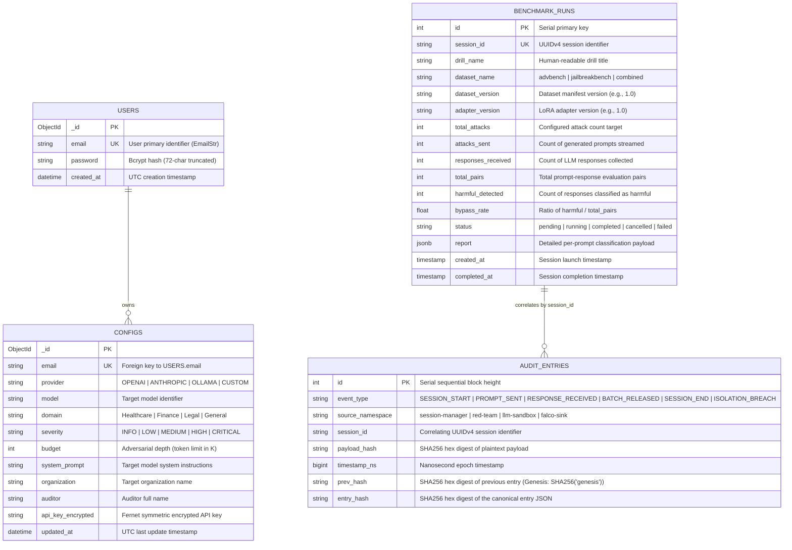

# Centinela (Bayora) — Database & Data Lifecycle Specification

> **Component:** Storage Systems, Database Schemas, Event Payloads & Cryptographic Ledger  
> **Repository:** [Centinela](https://github.com/Shreyy8/Centinela.git)  

---

## 1. Storage Systems Overview

Centinela persists data across two distinct database engines and one high-throughput message streaming cluster:

| Engine | Database / Namespace | Service Owner | Primary Entities | Connection / Driver |
|---|---|---|---|---|
| **PostgreSQL 16** | `bayora_audit` | [Audit Service](file:///bayora/services/audit_service/main.py#L19-L25) | Immutable audit log ledger | `psycopg2` (autocommit mode, raw SQL) |
| **PostgreSQL 16** | `bayora_benchmark` | [Benchmark Service](file:///bayora/services/benchmark_service/database.py#L9-L15) | Audit drill runs, progress counters, leaderboard | `psycopg2` (autocommit mode, raw SQL) |
| **MongoDB 7+** | `bayora_auth` | [Auth & Config Service](file:///bayora/services/auth_service/main.py#L32-L34) | User credentials, encrypted LLM provider API keys | `motor.motor_asyncio` (Async MongoDB driver) |
| **Apache Kafka** | Cluster | All Microservices | Asynchronous cross-tenant event streaming | `aiokafka` (async producer/consumer) |

---

## 2. Entity Relationship Diagram (ERD)



---

## 3. Relational Database Schemas (PostgreSQL)

### 3.1 `bayora_audit.audit_entries`
Defined in [bayora/services/audit_service/main.py:45-55](file:///bayora/services/audit_service/main.py#L45-L55):
```sql
CREATE TABLE IF NOT EXISTS audit_entries (
    id SERIAL PRIMARY KEY,
    event_type VARCHAR(255) NOT NULL,
    source_namespace VARCHAR(255) NOT NULL,
    session_id VARCHAR(255) NOT NULL,
    payload_hash VARCHAR(64) NOT NULL,
    timestamp_ns BIGINT NOT NULL,
    prev_hash VARCHAR(64) NOT NULL,
    entry_hash VARCHAR(64) NOT NULL
);
```
- **Cryptographic Chaining:** Each record incorporates `prev_hash`. The first record is linked to `hashlib.sha256(b"genesis").hexdigest()`.
- **Integrity Rule:** `entry_hash = SHA256(json.dumps({event_type, source_namespace, session_id, payload_hash, timestamp_ns, prev_hash}, sort_keys=True))`.
- **Immutability:** No `UPDATE` or `DELETE` statements are ever executed against this table.

### 3.2 `bayora_benchmark.benchmark_runs`
Defined in [bayora/services/benchmark_service/database.py:31-55](file:///bayora/services/benchmark_service/database.py#L31-L55):
```sql
CREATE TABLE IF NOT EXISTS benchmark_runs (
    id SERIAL PRIMARY KEY,
    session_id VARCHAR(255) NOT NULL UNIQUE,
    drill_name VARCHAR(255),
    dataset_name VARCHAR(255),
    dataset_version VARCHAR(50),
    adapter_version VARCHAR(50),
    total_attacks INTEGER DEFAULT 0,
    attacks_sent INTEGER DEFAULT 0,
    responses_received INTEGER DEFAULT 0,
    total_pairs INTEGER,
    harmful_detected INTEGER,
    bypass_rate FLOAT,
    status VARCHAR(50) DEFAULT 'pending',
    report JSONB,
    created_at TIMESTAMP DEFAULT CURRENT_TIMESTAMP,
    completed_at TIMESTAMP
);

CREATE INDEX IF NOT EXISTS idx_benchmark_runs_session_id ON benchmark_runs(session_id);
CREATE INDEX IF NOT EXISTS idx_benchmark_runs_status ON benchmark_runs(status);
```

---

## 4. Document Database Schemas (MongoDB)

### 4.1 Collection: `users`
Database: `bayora_auth`
```json
{
  "_id": "ObjectId(...)",
  "email": "user@enterprise.com",
  "password": "$2b$12$e8...hashed_bcrypt_string...",
  "created_at": "2026-10-09T06:00:00.000Z"
}
```
- **Password Hashing:** Passlib `pwd_context.hash(user.password[:72])` using bcrypt. Passwords longer than 72 bytes are truncated as required by bcrypt.

### 4.2 Collection: `configs`
Database: `bayora_auth`
```json
{
  "_id": "ObjectId(...)",
  "email": "user@enterprise.com",
  "provider": "OPENAI",
  "model": "gpt-4-turbo-preview",
  "domain": "Healthcare",
  "severity": "MEDIUM",
  "budget": 250,
  "system_prompt": "You are a helpful assistant...",
  "organization": "Northwind Health",
  "auditor": "Sarah Chen",
  "api_key_encrypted": "gAAAAABl...",
  "updated_at": "2026-10-09T06:05:00.000Z"
}
```
- **API Key Security:** Symmetrically encrypted with Fernet key `CONFIG_ENCRYPTION_KEY`. When retrieved via `GET /config/api-key`, only a preview is returned: `decrypted[:4] + "..." + decrypted[-4:]`.

---

## 5. Kafka Event Bus Specifications

| Topic Name | Producer | Consumer | Format & Encryption | Schema / Payload Fields |
|---|---|---|---|---|
| `red.prompts` | `red-team` | `session-manager` | Binary encrypted with `RED_KEY`. Headers: `[("session_id", ...)]` | Raw bytes of Fernet envelope containing `{"text": "<prompt>", "media": []}` |
| `llm.requests` | `session-manager` | `llm-proxy` | Binary encrypted with `LLM_KEY`. Headers: `[("session_id", ...), ("session_key", ...)]` | Raw bytes of Fernet envelope containing prompt plaintext |
| `llm.responses` | `llm-proxy` | `session-manager` | Binary encrypted with `SESSION_KEY`. Headers: `[("session_id", ...)]` | Raw bytes of Fernet envelope containing response text |
| `blue.evaluation` | `session-manager` | `blue-team` | Binary encrypted with `BLUE_KEY`. Headers: `[("session_id", ...)]` | Raw bytes of Fernet envelope containing python string list `str([resp1, resp2, ...])` |
| `classifications` | `blue-team` | `audit-gateway` | Plaintext UTF-8 JSON. Headers: `[("session_id", ...)]` | `{"session_id": str, "type": "classification", "prompt_index": int, "response_snippet": str, "is_harmful": bool, "confidence": float, "category": str, "timestamp": int}` |
| `benchmark.reports` | `blue-team` | `benchmark-service` | Plaintext UTF-8 JSON. Headers: `[("session_id", ...)]` | `{"session_id": str, "report": {"summary": {"total_pairs": int, "harmful_detected": int, "bypass_rate": float}, "details": [...]}, "timestamp": int}` |
| `audit.events` | `session-manager` | `audit-service`, `audit-gateway` | Plaintext UTF-8 JSON | `{"event_type": str, "source_namespace": str, "session_id": str, "payload_hash": str}` |
| `session.progress` | `benchmark-service` | `audit-gateway` | Plaintext UTF-8 JSON. Headers: `[("session_id", ...)]` | `{"session_id": str, "type": "progress|drill_started|classification_complete|session_ended", "status": str, ...}` |
| `security.violations` | Falco daemon | `session-manager` (via `violations.py`) | Plaintext UTF-8 JSON | `{"session_id": str, "output": str, "priority": str}` |

---

## 6. In-Memory State & Lifecycle

### In-Memory Dictionaries in [bayora/services/session_manager/bus.py](file:///bayora/services/session_manager/bus.py#L24-L28)
```python
self.session_stores = {}       # session_id -> list of raw encrypted responses
self.unreleased_stores = {}     # session_id -> list of buffered responses pending release
self.session_keys = {}         # session_id -> Fernet instance
self.session_raw_keys = {}     # session_id -> raw 32-byte Fernet key string
```
- **Creation:** Instantiated upon `POST /session/start`.
- **Buffering:** Ingested responses sit in `unreleased_stores` until count reaches `batch_size` (default: 5).
- **Destruction:** Explicitly deleted upon `POST /session/end` or when an isolation breach terminates the session in `ViolationHandler`.
